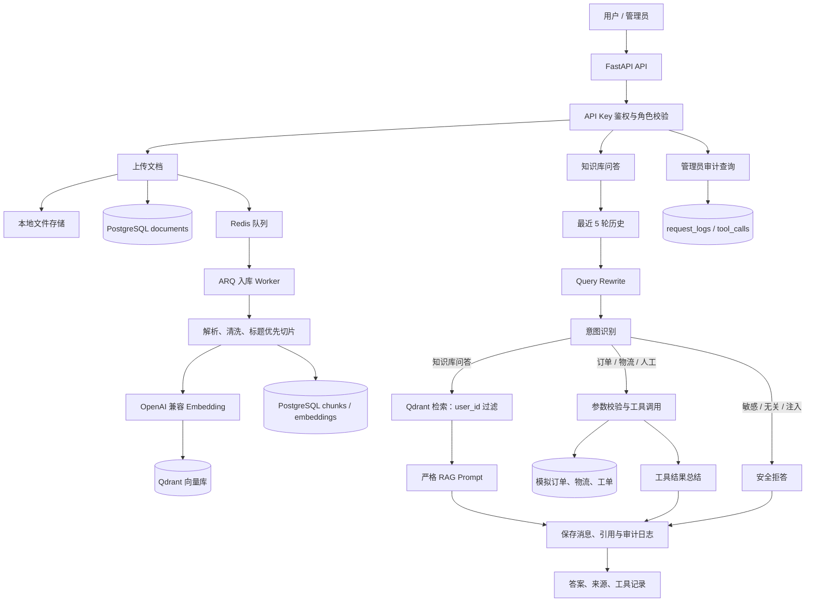

# 系统架构

## 安全边界

- 所有业务 API 需要 `X-API-Key`；请求中的 `user_id` 必须与密钥所属用户一致。
- 文档、会话、订单和向量检索均按用户归属隔离；Qdrant 检索始终附带 `user_id` 过滤。
- 管理员日志和工具记录接口额外校验 `admin` 角色，并对可能的密钥文本脱敏。
- `.env`、上传原文件、虚拟环境和缓存均不进入 Git。
